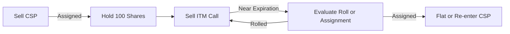

# 🏦 ITM Covered Call (ITMCC) Playbook

## 🎯 Strategy Objective

Sell **deep or moderately ITM Covered Calls** to:

* Maximize **extrinsic value capture**
* Minimize **capital at risk**
* Utilize **assignment timing** as an edge
* Roll positions before assignment or manage post-assignment recovery

---

## 🧭 Strategy Structure

1. **Entry Path**:

   * **Cash-Secured Put (CSP)** assigned into long shares
   * Or direct purchase of stock

2. **Call Sell**:

   * Sell an **in-the-money call**, targeting **≥75% ITM**
   * Choose strikes with elevated IV or approaching earnings

3. **Management**:

   * Monitor **roll opportunities** before assignment
   * Roll **early** to capture decaying extrinsic value
   * If assigned, **immediately evaluate CSP re-entry** or convert to PMCC

---

## 📀 Key Metrics

| Metric     | Formula      | Description                   |
| ---------- | ------------ | ----------------------------- |
| Max Profit | `K - S₀ + C` | Strike - Stock + Call Premium |
| Max Loss   | `S₀ - C`     | Stock cost - Premium          |
| Breakeven  | `S₀ - C`     | Stock less premium            |

---

## 🔄 Strategy Lifecycle

---

## 🧪 Example Trade

* **Underlying**: INTC @ \$20.70
* **CSP**: Sold 21P for \$0.58 → Assigned
* **Stock Cost Basis**: \$20.42
* **Sold Call**: 20C for \$1.20

> 📈 Max Profit: \$0.78
> 📉 Max Loss: \$20.42 - \$1.20 = \$19.22 (if goes to 0)
> ♻️ Breakeven: \$20.42 - \$1.20 = \$19.22

---

## 🧠 Supporting Files

* [`risk_return_calcs.ipynb`](./risk_return_calcs.ipynb): Profit/loss modeling
* [`triggers.csv`](./triggers.csv): Playbook setup conditions

---

*Last updated: 2025-07-28*
